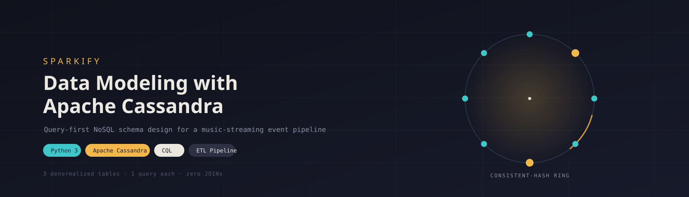
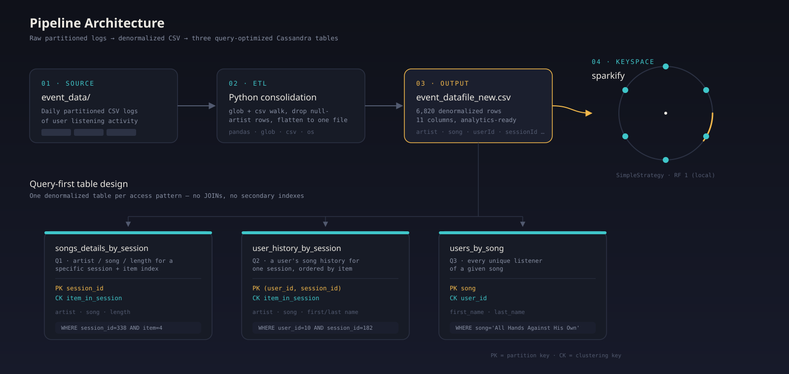
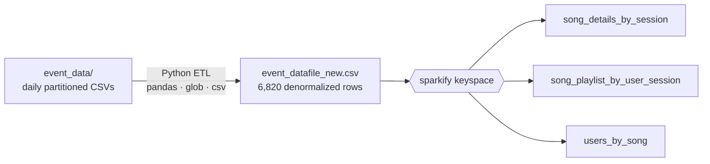
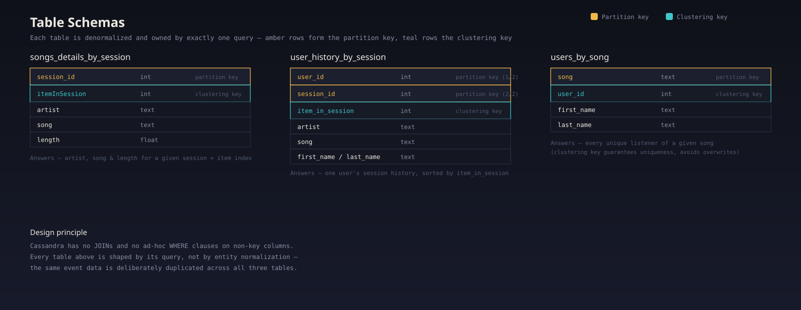

<div align="center">



<br/>

[](https://www.python.org/)
[](https://cassandra.apache.org/)
[](https://jupyter.org/)
[](LICENSE)
[]()

**A query-first NoSQL data model for a music-streaming startup's event pipeline —**
**built with Python, CQL, and Apache Cassandra.**

</div>

<br/>

## Overview

Sparkify's analytics team needs fast answers to a small, fixed set of questions about how people listen to music — not a general-purpose relational store. This repository walks through the full pipeline: consolidating partitioned raw event logs into one denormalized dataset, then designing and populating three Apache Cassandra tables, each shaped around exactly one query.

Cassandra has no `JOIN`, no ad-hoc `WHERE` on non-key columns, and no query planner to bail you out — so the schema *is* the query. That constraint is the whole design story here.

## Table of contents

- [Why query-first modeling](#why-query-first-modeling)
- [Pipeline architecture](#pipeline-architecture)
- [Data model](#data-model)
- [Repository structure](#repository-structure)
- [Getting started](#getting-started)
- [Results](#results)
- [Design notes](#design-notes)
- [License](#license)

## Why query-first modeling

| | Relational (normalized) | Cassandra (denormalized) |
|---|---|---|
| Optimizes for | Storage efficiency, flexible ad-hoc queries | Read latency at scale, known access patterns |
| Schema driven by | Entities and their relationships | The exact queries the app will run |
| Joins | Core operation | Not supported — data is duplicated instead |
| Scaling model | Vertical, harder to shard | Horizontal, partitioned across a ring by design |

In this project the same event data is intentionally copied into three tables. That duplication is the cost of paying for reads that are always a single-partition lookup, even at cluster scale.

## Pipeline architecture





**Preprocessing.** The notebook walks `event_data/`, reads every partitioned CSV, drops rows with a missing artist, and writes a single flat file — `event_datafile_new.csv` — with 11 columns: `artist, firstName, gender, item_in_session, lastName, length, level, location, sessionId, song, userId`.

## Data model



| # | Business question | Table | Primary key | Key rationale |
|---|---|---|---|---|
| 1 | Artist, song title, and length heard during `sessionId = 338`, `item_in_session = 4` | `song_details_by_session` | `((session_id), item_in_session)` | `session_id` partitions rows across the ring; `item_in_session` clusters and sorts within a session. |
| 2 | Artist, song (sorted by item), and listener name for `userId = 10`, `sessionId = 182` | `song_playlist_by_user_session` | `((user_id, session_id), item_in_session)` | Composite partition key spreads load evenly; clustering key preserves listening order. |
| 3 | Every listener (first/last name) of *"All Hands Against His Own"* | `users_by_song` | `((song), user_id)` | `song` partitions by track; `user_id` as a clustering key keeps every listener instead of overwriting one row per song. |

## Repository structure

```text
sparkify-cassandra-datamodel/
├── notebooks/
│   └── sparkify_cassandra_etl.ipynb   # ETL + CQL modeling notebook (run top to bottom)
├── event_data/                        # Partitioned raw CSV event logs (not committed, see .gitignore)
├── images/                            # Architecture, schema, and banner graphics
│   ├── banner.svg
│   ├── pipeline_architecture.svg
│   └── data_model_erd.svg
├── requirements.txt
├── .gitignore
├── LICENSE
└── README.md
```

## Getting started

**Prerequisites**
- Python 3.9+
- Apache Cassandra running locally on `127.0.0.1` ([install guide](https://cassandra.apache.org/_/download.html))
- `event_data/` populated with the partitioned source logs

**Setup**

```bash
git clone https://github.com/<your-username>/sparkify-cassandra-datamodel.git
cd sparkify-cassandra-datamodel
python -m venv .venv && source .venv/bin/activate
pip install -r requirements.txt
```

**Run**

```bash
jupyter notebook notebooks/sparkify_cassandra_etl.ipynb
```

Run the notebook top to bottom: it consolidates `event_data/` into `event_datafile_new.csv`, connects to the local Cassandra cluster, creates the `sparkify` keyspace, builds all three tables, loads them via parameterized `INSERT`s, and validates each with a `SELECT`.

## Results

<details>
<summary><strong>Query 1</strong> — artist, song, length for a session + item index</summary>

```sql
SELECT artist, song, length FROM song_details_by_session
WHERE session_id = 338 AND item_in_session = 4;
```

| artist | song | length |
|---|---|---|
| Faithless | Music Matters (Mark Knight Dub) | 495.3073 |

</details>

<details>
<summary><strong>Query 2</strong> — a user's session history, ordered by item</summary>

```sql
SELECT artist, song, first_name, last_name FROM song_playlist_by_user_session
WHERE user_id = 10 AND session_id = 182;
```

| artist | song | listener |
|---|---|---|
| Down To The Bone | Keep On Keepin' On | Sylvie Cruz |
| Three Drives | Greece 2000 | Sylvie Cruz |
| Sebastien Tellier | Kilometer | Sylvie Cruz |
| Lonnie Gordon | Catch You Baby (Steve Pitron & Max Sanna Radio Edit) | Sylvie Cruz |

</details>

<details>
<summary><strong>Query 3</strong> — every listener of a given song</summary>

```sql
SELECT first_name, last_name FROM users_by_song
WHERE song = 'All Hands Against His Own';
```

| first_name | last_name |
|---|---|
| Jacqueline | Lynch |
| Tegan | Levine |
| Sara | Johnson |

</details>

## Design notes

- **One table, one query.** Each table exists to answer a single access pattern — there is no attempt to model Sparkify's data generically.
- **Composite partition keys prevent hot partitions.** `(user_id, session_id)` in Query 2 spreads a single user's many sessions across the ring instead of concentrating them on one node.
- **Clustering keys do double duty.** They both sort results (Query 1, Query 2) and guarantee row uniqueness so inserts don't silently overwrite each other (Query 3).
- **Duplication is the design, not a flaw.** The same raw event feeds all three tables; Cassandra trades storage for read latency.

## License

Released under the [MIT License](LICENSE).

---

<div align="center">
<sub>Built by Moses Bargue Kortu Jr.</sub>
</div>
